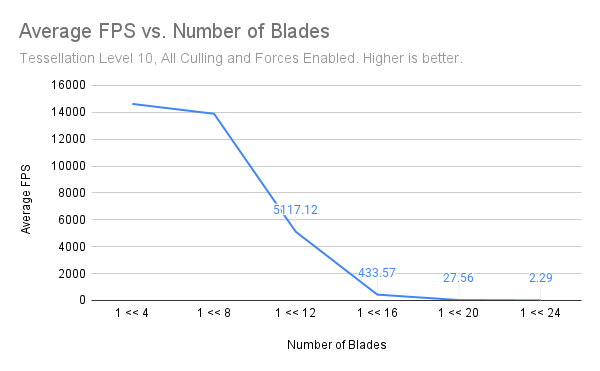
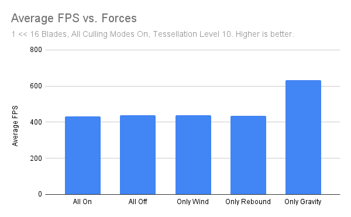

Vulkan Grass Rendering
==================================

**University of Pennsylvania, CIS 565: GPU Programming and Architecture, Project 5**

* Daniel Gerhardt
  * https://www.linkedin.com/in/daniel-gerhardt-bb012722b/
* Tested on: Windows 23H2, AMD Ryzen 9 7940HS @ 4GHz 32GB, RTX 4070 8 GB (Personal Laptop)

### Description

The Vulkan Grass Renderer project is an implementation of [Responsive Real-Time Grass Rendering for General 3D Scenes](https://www.cg.tuwien.ac.at/research/publications/2017/JAHRMANN-2017-RRTG/JAHRMANN-2017-RRTG-draft.pdf) in Vulkan. The grass is represented by bezier curves and is tessellated for the render. There are also 3 forces and culling methods applied. The following sections include descriptions of the forces and culling methods. Please see the paper linked above for in depth summaries equations.

#### Forces

To simulate grass, three forces are applied. They are wind, rebound, and gravity. Wind is represented with a Perlin noise function that is parameterized by time and the position of the blade so that wind varies as time passes and it varies across the blades rather than acting on them all equally. Rebound or recovery represents a blade's inclination to return to its upright position, which acts against the wind. Gravity is an ever acting force that keeps the blade in place and pulls it downward.

#### Culling Methods

In order to boost performance, culling methods are often used to not render grass that is not viewable or would not have an effect on the experience of the user. The three methods of culling are distance culling, frustum culling, and orientation culling. Distance culling involves breaking the distance between the camera and far plane into buckets, and removing more blades from the farther buckets, so grass that is nearly unseeable or far away is not rendered as frequently as close blades. Frustum culling is removing from the render blades that are outside of the viewable screen. Orientation culling removes blades that are perpendicular(or nearly so) to the viewer, which can lead to artifacts or unseeable grass, as the blade is typically smaller than a pixel in these cases.

### Performance Analysis

It is clear that adding more blades decreases performance, and the drop off seems steeper as the number of blades increases past 1 << 8.

