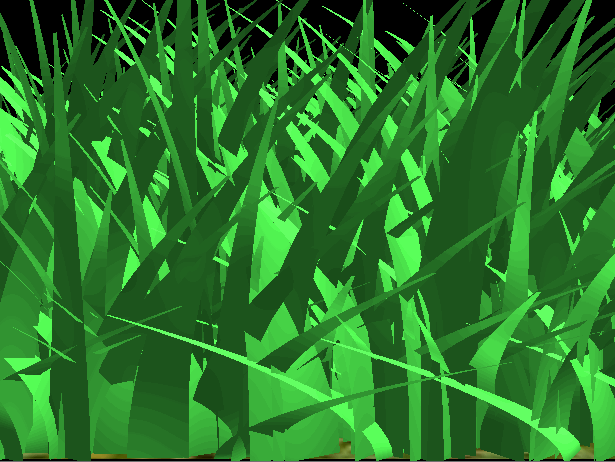
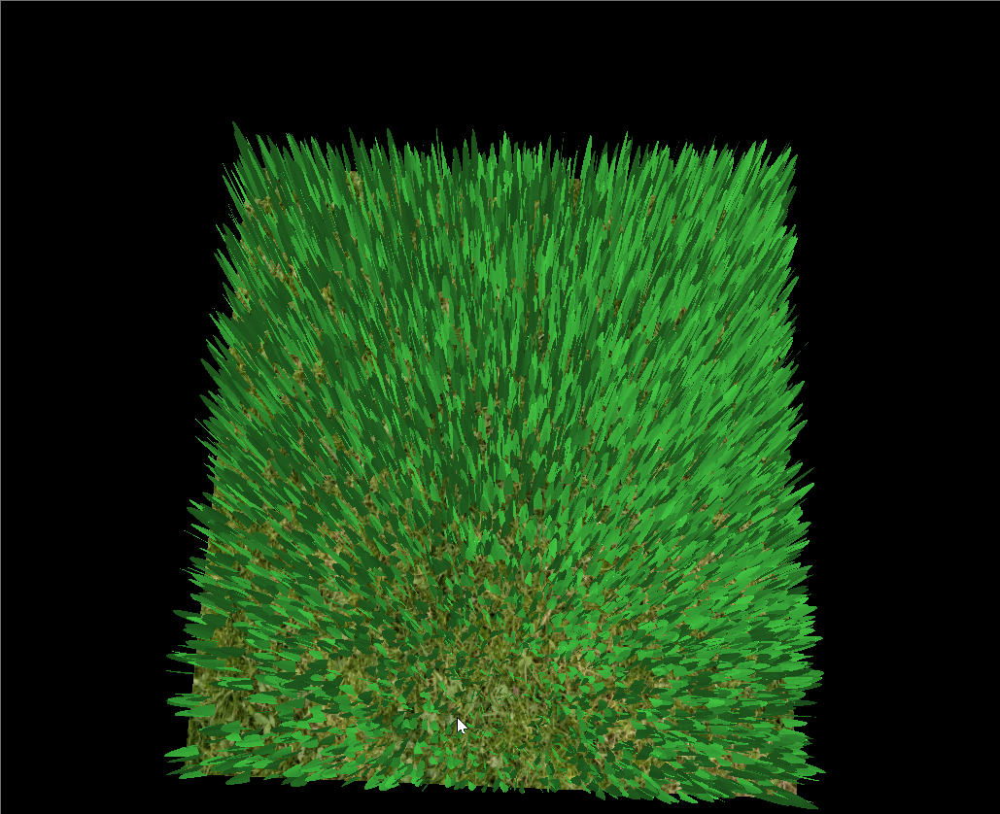
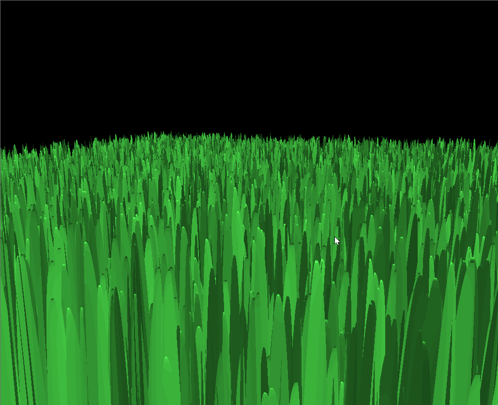
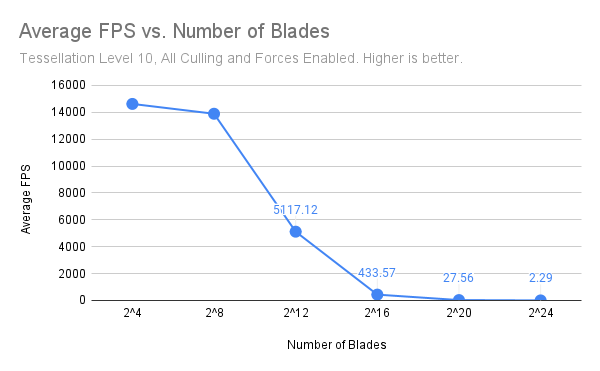
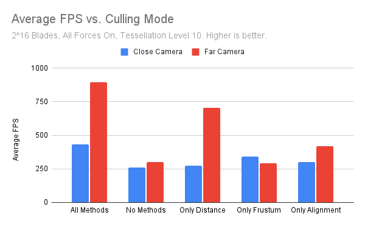
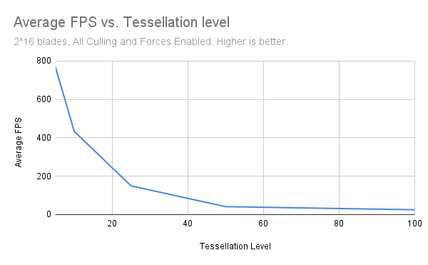

Vulkan Grass Rendering
==================================

**University of Pennsylvania, CIS 565: GPU Programming and Architecture, Project 5**

* Daniel Gerhardt
  * https://www.linkedin.com/in/daniel-gerhardt-bb012722b/
* Tested on: Windows 23H2, AMD Ryzen 9 7940HS @ 4GHz 32GB, RTX 4070 8 GB (Personal Laptop)

### Description

The Vulkan Grass Renderer project is an implementation of [Responsive Real-Time Grass Rendering for General 3D Scenes](https://www.cg.tuwien.ac.at/research/publications/2017/JAHRMANN-2017-RRTG/JAHRMANN-2017-RRTG-draft.pdf) in Vulkan. The grass is represented by bezier curves and is tessellated for the render. There are also 3 forces and culling methods applied. The following sections include descriptions of the forces and culling methods. Please see the paper linked above for in depth summaries equations.

#### Forces

To simulate grass, three forces are applied. They are wind, rebound, and gravity. 

1. Wind is represented with a Perlin noise function that is parameterized by time and the position of the blade so that wind varies as time passes and it varies across the blades rather than acting on them all equally. 

2. Rebound or recovery represents a blade's inclination to return to its upright position, which acts against the wind and gravity, so that gravity does not pull the blade with nothing keeping the blade from folding into the ground. 

3. Gravity is an ever acting force that keeps the blade in place and pulls it downward.

Gravity only: 

Gravity with rebound: 

Wind, gravity, and rebound: 

#### Culling Methods

In order to boost performance, culling methods are often used to not render grass that is not viewable or would not have an effect on the experience of the user. The three methods of culling are distance culling, frustum culling, and orientation culling. Distance culling involves breaking the distance between the camera and far plane into buckets, and removing more blades from the farther buckets, so grass that is nearly unseeable or far away is not rendered as frequently as close blades. Frustum culling is removing from the render blades that are outside of the viewable screen. Orientation culling removes blades that are perpendicular(or nearly so) to the viewer, which can lead to artifacts or unseeable grass, as the blade is typically smaller than a pixel in these cases.

Distance culling: 

Frustum culling: 

Orientation culling: 

### Performance Analysis

For measuring performance, FPS was measured by taking the time between rendered frames. Each test was performed 3 times, and the shown FPS is the average across the 3 tests. The default testing setup was 2^16 blades, tessellation level 10, and all forces and culling enabled. The charts show what was changed amongst the tests.

The following were set as the constants for the culling methods: 
* ORIENTATION_CULL_VAL = 0.9
* FRUSTUM_CULL_VAL = 0.05
* MAX_DISTANCE = 40
* NUM_BUCKETS = 10

It is clear that adding more blades decreases performance, and the drop off seems steeper as the number of blades increases past 2^8, up until around 2^20, where the performance is so low that adding more blades cannot bring the performance down much more. It seems that for my machine, 2^12 blades is the "sweet spot", where performance is only about 3 times less than 2^8 blades, but there are 4 times more blades. There are more fall offs moving to 2^16 blades, as the performance has an over 10 times decrease from 2^12 blades.

Turning on and off the culling modes, as well as changing the location of the camera shows the impact of the three different culling types. With all methods on, there is a hefty increase over the performance with all methods off. Additionally, when the camera is farther from the blades, the performance jumps up massively. It can be seen that distance and alignment culling are the cause for this. As distance increases, more blades are culled since more blades are removed from buckets farther from the camera. Also, as the camera becomes farther from the blades, more fall into the alignment "sweet spot" with the camera because they appear smaller due to perspective divide. Frustum culling does not help with performance as the camera gets farther, because this actually concentrates the blades in the frame. It instead mitigates performance as grass takes up the entire screen, because blades outside of the screen will not be rendered.

I like this chart a lot because of how incredibly misleading it is. Gravity does not actually boost performance, but instead when acting alone causes the blades to collapse inside themselves and not render at all! See the following gif for the bug that caused me an evening of pain:

It turns out that other than gravity(just kidding) every force has a minimal impact on performance past the margin of error, which is expected as compute is very fast on the GPU. With forces there is no additional memory access or outstanding other reason for a change in performance.

The tessellation level chart has quite a pleasing curve, where increasing the tessellation level always decreases performance, but at a smaller and smaller rate. This is not surprising, as converting the bezier curves into more and more vertices means more data has to be passed and more computation is done as the vertex shaders are acting per vertex.

